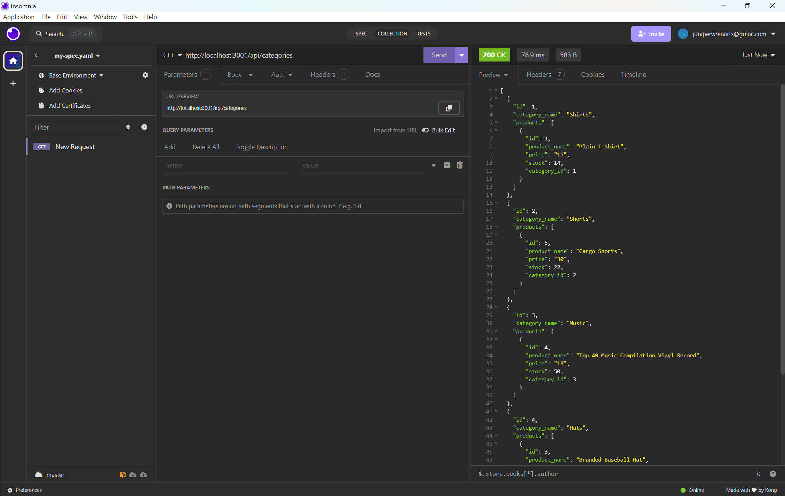

# Juniper's E-Commerce Back End

## Overview

In this project, I built the back end for an e-commerce site by configuring a working Express.js API to use Sequelize, a popular ORM (Object-Relational Mapping) library, to interact with a MySQL database. The goal was to create a functional API that allows for performing CRUD (Create, Read, Update, Delete) operations on categories, products, and tags.





## Getting Started

### Prerequisites

You will need to have the following installed. 

- [Node.js](https://nodejs.org/)
- [npm (Node Package Manager)](https://www.npmjs.com/)
- [MySQL](https://www.mysql.com/)
- [MySQL Workbench](https://www.mysql.com/products/workbench/)

### Installation

1. Clone the repository to your local machine:

   ```bash
   git clone <ssh key from github repo>

2. Open local repo in code editor:

   ```bash
   I used VS code 

3. Install the necessary packages:

   ```bash
   npm i
   npm i MySql2
   npm i sequelize 

4. Create a .env file in the root directory and add your MySQL database credentials:


   ```env
    DB_NAME=your_database_name
    DB_USER=your_database_user
    DB_PASSWORD=your_database_password


5. Open Workbench and run the following commands to create the database:

   ```workbench
   -- DROP DATABASE
    DROP DATABASE IF EXISTS ecommerce_db;

    -- CREATE DATABASE
    CREATE DATABASE ecommerce_db;

6. Seed the database with sample data:

   ```bash
   npm run seeds/index.js

5. To run the application you will need to start the server and THEN navigate over to insomnia:

   ```bash
   node server.js 


   (Your server is now running. You can access the API at http://localhost:3001.)